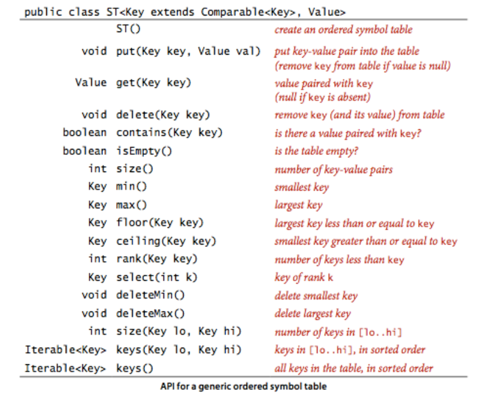

## Symbol tables (符号表)

符号表可以理解为一个键值对list， 每次可以存放key， 之后可以通过key找到list中的value。

# symbol table

## 它的API
1. put(key,value)
2. get(Key) ---返回value
3. delete(key) ---通过key删除键值对
4. contains(key) ---是否存在键值对

可以把它想象成Map。
1. 一个key只有单个value。
2. 没有key可以和null关联。 （No key can be associated with the value null），so  you can just use the method get(key) to judge whether key is here.
3. 删除操作： 有两种删除， 惰性删除和急切删除。 惰性删除就是直接指定对应key的value为null， 这样通过get方法返回的是null， 会被判定为没有此key。 急切删除就是实在地删除。

# equals()方法的规定：
**Java's convention（惯例） is that equals() must implement an equivalence relation: **

1. Reflexive（反射的）: x.equals(x) is true.
2. Symmetric(对称的): x.equals(y) is true if and only if y.equals(x) is true.
3. Transitive（传递性）: if x.equals(y) and y.equals(z) are true, then so is x.equals(z).

equals()方法还带有参数， 特点是：
1. 不为null

# ordered symbol table
因为key提供了Comparable实现，我们可以使用key的排序创建一个ordered sybol table.

## API

1. minimum and maximum: 找到一组table的最小和最大key。
2. the floor operation (find the largest key that is less than or equal to the given key)
3. the ceiling operation (find the smallest key that is greater than or equal to the given key).
4. rank(): 查看小于给定key的数量， 目的是标定插入位置。
5. Key select(int k): 知道给定key在rank中的位置。
	... ...
	
6. Key的CompareTo()方法和equals()方法应该保持一致。 

FrequencyCounter.java 用来

# 几种Symbol tables的实现

## sequential search ST（顺序搜索ST，unordered）
sequential search ST使用linked list实现。

主要是get() 和 put()方法。 get方法遍历这个list， 使用equals()方法匹配，如果找到匹配的key， return 它的value。
put()方法同样是遍历list。 有两种可能性。 1找到了， 那么替换其value。 2没有找到， 那么在list的头部新建一个node， 存入key和value。
见 com.Chapter3.Section1.SequentialSearchST<Key, Value>

## binary search ST (二分查找ST，ordered)
使用两个并行的array实现， 其中一个存储key， 另外一个存储value。 其中， key-value的顺序取决于key的顺序。
注意，在BSST中，最重要的一个方法是int rank(Key), put、get、floor、ceil等方法都需要调用这个方法完成自己的功能。
再者， Key select(int k)， 这个方法的功能是寻找排名为k的键。从1开始。 和rank里面的返回值int对应。 